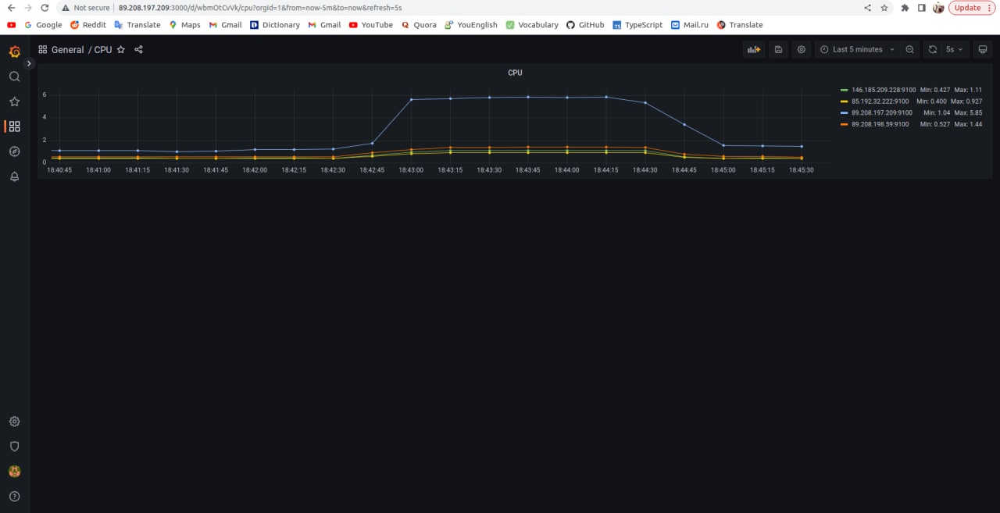
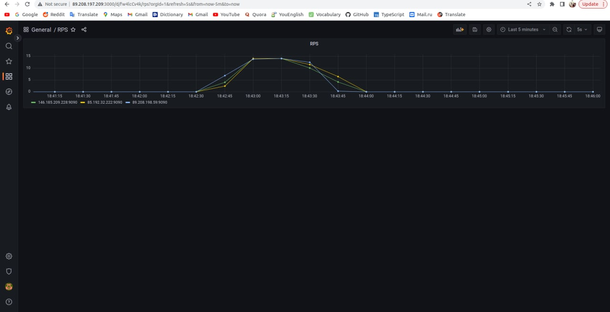
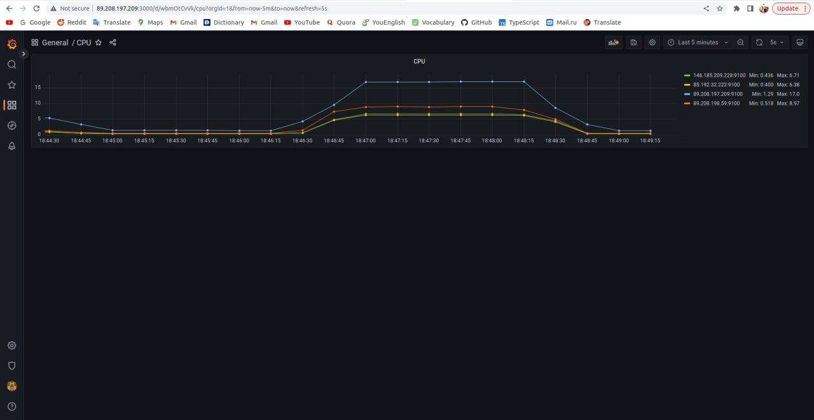
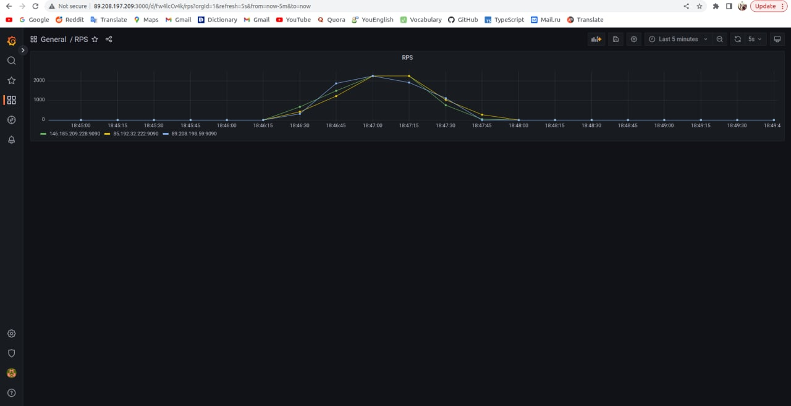
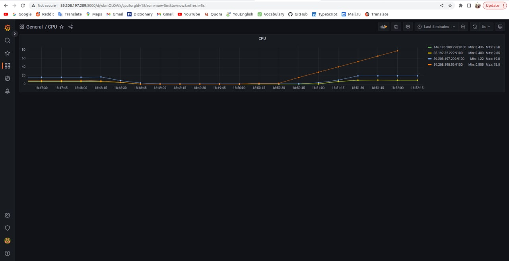
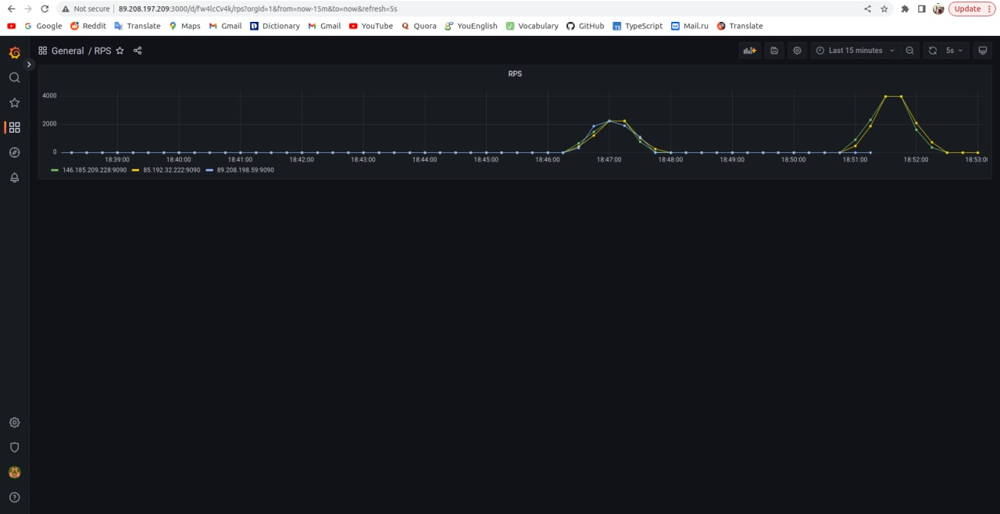

# 3 лабораторная работа, балансировка нагрузки на трёх "виртуалках"

Балансировка приводилось при помощи Haproxy, вот конфиг для неё:

```
global
        log /dev/log    local0
        log /dev/log    local1 notice
        chroot /var/lib/haproxy
        stats socket /run/haproxy/admin.sock mode 660 level admin expose-fd listeners
        stats timeout 30s
        user haproxy
        group haproxy
        daemon

        # Default SSL material locations
        ca-base /etc/ssl/certs
        crt-base /etc/ssl/private

        # See: https://ssl-config.mozilla.org/#server=haproxy&server-version=2.0.3&config=intermediate
        ssl-default-bind-ciphers ECDHE-ECDSA-AES128-GCM-SHA256:ECDHE-RSA-AES128-GCM-SHA256:ECDHE-ECDSA-AES256-GCM-SHA384:ECDHE-RSA-AES256-G>
        ssl-default-bind-ciphersuites TLS_AES_128_GCM_SHA256:TLS_AES_256_GCM_SHA384:TLS_CHACHA20_POLY1305_SHA256
        ssl-default-bind-options ssl-min-ver TLSv1.2 no-tls-tickets

defaults
        mode http
        timeout client 1s
        timeout server 1s
        timeout connect 5s
        timeout http-request 10s
        retries 3
        option redispatch
frontend http-frontend
        mode http
        bind *:80
        default_backend http-backend
backend http-backend
        mode http
        balance roundrobin
                server ubuntu-1 <server-1-ip>:80 check
                server ubuntu-2 <server-2-ip>:80 check
                server ubuntu-3 <server-3-ip>:80 check
```

Также попробовал ещё балансировку через nginx с таким конфигом
```
events {
    worker_connections 2048;
}

http {

    upstream backend {
        server IP1 max_fails=2 fail_timeout=10s;
        server IP2 max_fails=2 fail_timeout=10s;
        server IP3 max_fails=2 fail_timeout=10s;
    }

    server {
        listen 80;

        location / {

            proxy_connect_timeout 50ms;
            proxy_send_timeout 100ms;
            proxy_read_timeout 487ms;

            proxy_next_upstream error timeout http_403 http_404;
            proxy_next_upstream_tries 2;
            proxy_next_upstream_timeout 1s;

            proxy_set_header Host $host;
            proxy_set_header X-Real-IP $remote_addr;
            proxy_pass  http://backend/;
        }
    }
}
```

Из docker-compose в папке src были подняты инстансы "виртуалок", в них - через графану созданы дэшборды (через json-файлики: cpu.json, rps.json), для CPU и RPS


Далее тесты: функциональное и нагрузочное тестирование - для этого см. репозитории по типу [такого](https://github.com/mailcourses/technopark-dbms-forum)

Но попробовал тестить и так (по сути, просто пинг)
```
wrk -t12 -c400 -d30s 'http://<your-main-server-ip>:80/api'
```
Вот примерные скрины получившегося:

Функциональное тестирование:



Нагрузочное тестирование, 3 виртуалки:



Нагрузочное тестирование, 2 виртуалки в момент отключения третьей:


