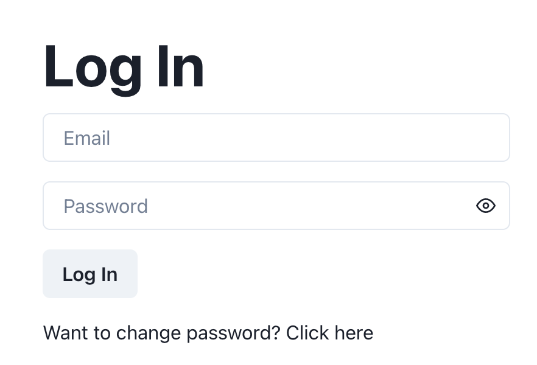
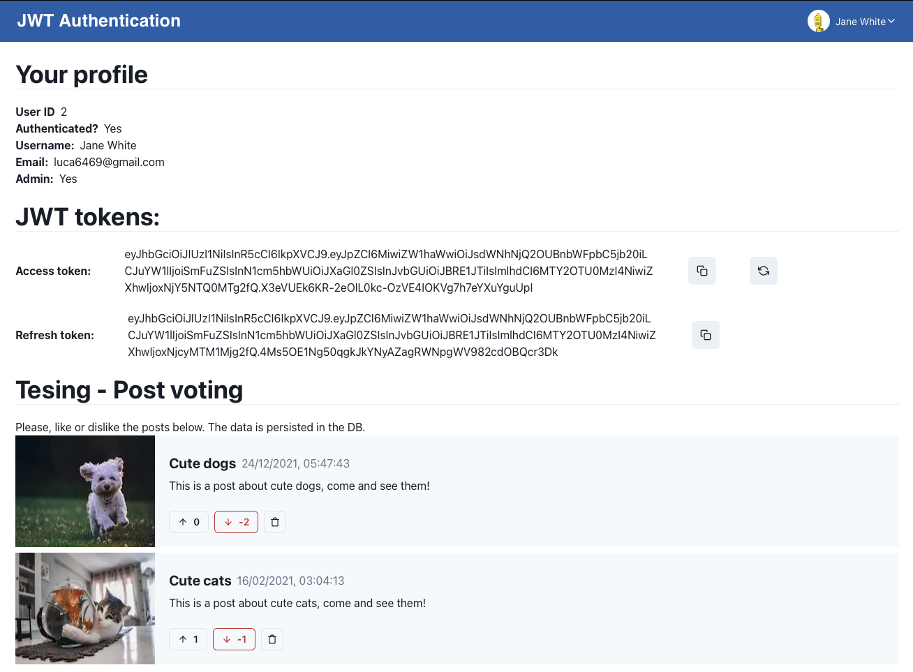
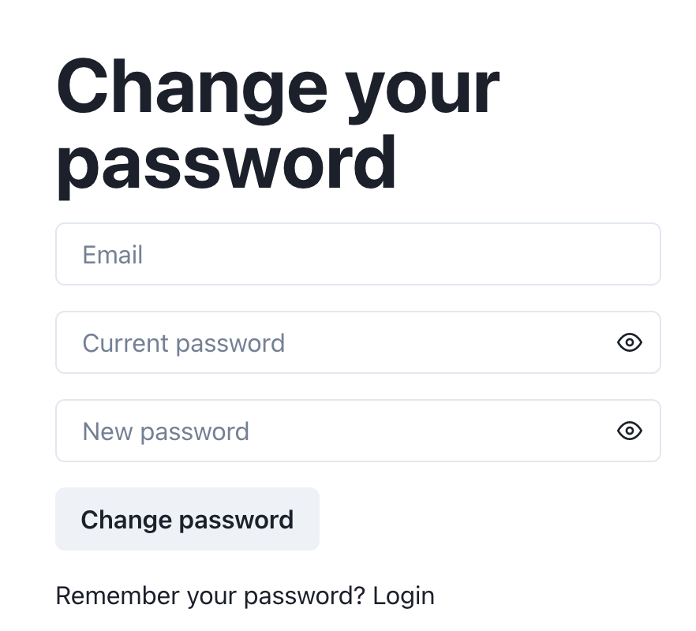
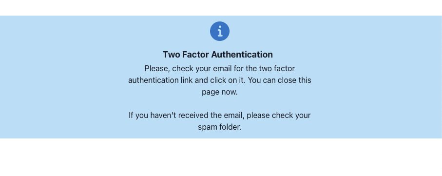
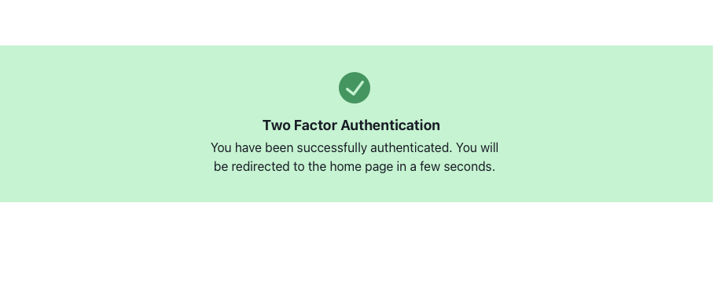
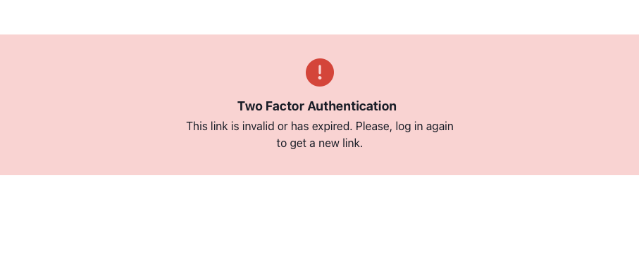
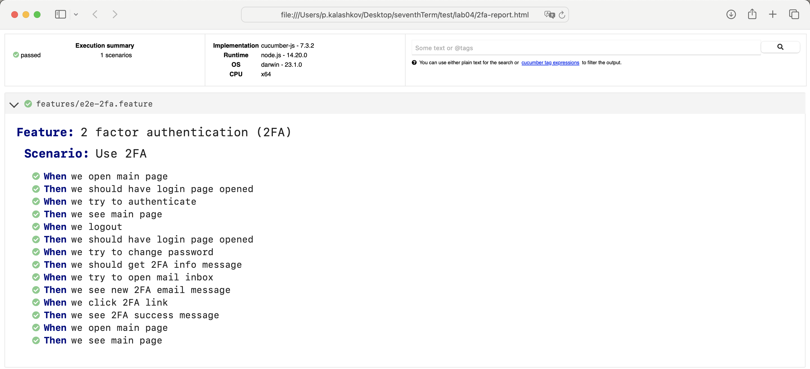

# Лабораторная работа 4, Тестирование

Проект - немного модернизированный проект с Технопарка, форум - включает в себя JWT авторизацию, а теперь и двухфакторную аутентификацию через email при смене пароля.

E2E тесты написаны при помощи BDD фреймворка для JavaScript - Cucumber.js

В папке features можно найти сценарий тестирования, а также скрипт, содержащий реализацию отдельных шагов.

Как это всё выглядит:

Авторизация:

Основная страница:

Смена пароля:

Страница сообщения с двухфакторной аутентификацией:

Страница по переходу по ссылке из письма:

Если ссылка протухла или уже невалидна:

Прогон тестов можно посмотреть в GitLabCI, пример отчёта:

